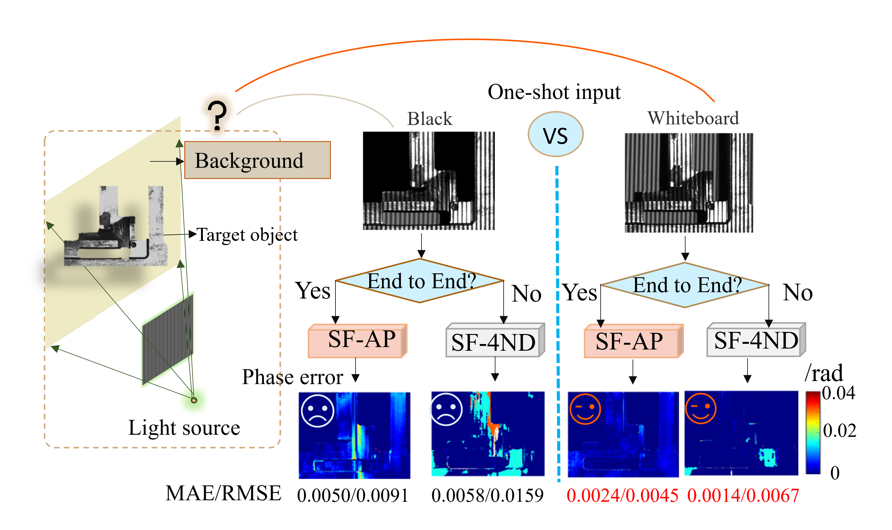
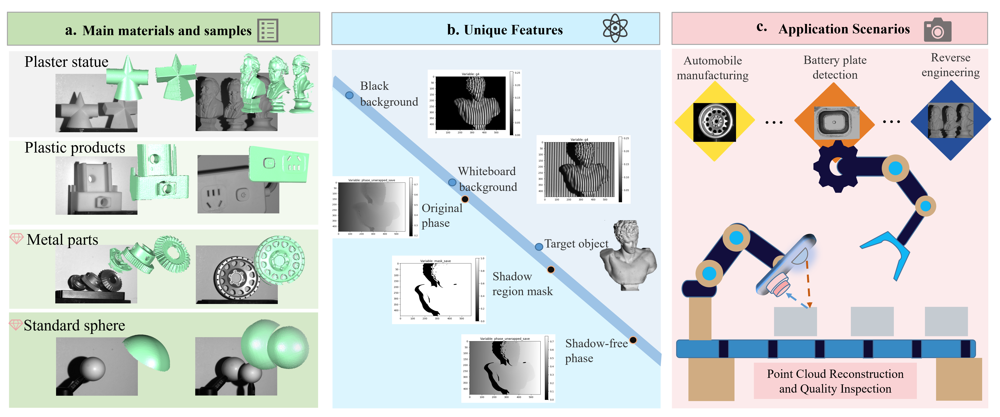
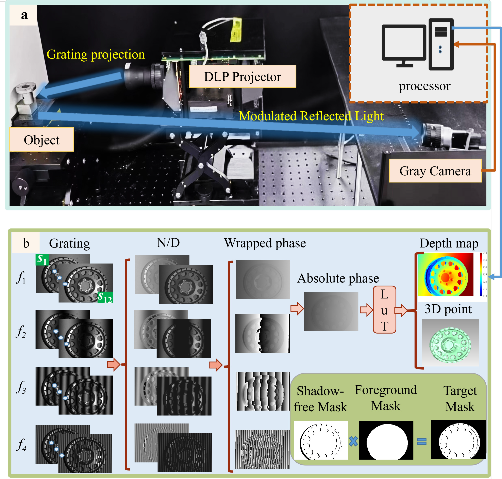

# SL3D-BF: A Real-World Structured Light 3D Dataset with Background-to-Foreground Enhancement

This repository contains the resources for the **SL3D-BF** dataset, a real-world Structured Light 3D (SL3D) dataset. It's designed for intelligent manufacturing, focusing on how background choices enhance foreground reconstruction accuracy.

## Introduction

Deep learning in SL3D is promising, but progress is slowed by a lack of comprehensive real-world datasets. This work introduces SL3D-BF, built on the finding that a whiteboard background can significantly improve foreground prediction accuracy (up to 82% better than black). This dataset aims to boost research in SL3D, depth estimation, defect detection, and semantic segmentation.

## Dataset Overview

SL3D-BF features:
* **~2,100 real-world scenes** with diverse objects (metal, plastic, plaster).
* **Unique full-process data:** Includes gratings, phase maps, depth maps, 3D point clouds, and crucial **shadow and foreground masks**.
* **Standard parts** for accurate 3D evaluation.

## Data Acquisition and System

The dataset was captured using a high-precision single-camera, single-projector system. It includes all data from raw grating projection to the final 3D point cloud and derived masks.

**System Hardware & Optical Path:**

* **Workflow:** Automated collection and processing. ~10 seconds per scene total.

## How to Use/Access the Dataset

Dataset link: [https://github.com/LiYiMingM/Dataset_SL3D_BF](https://github.com/LiYiMingM/Dataset_SL3D_BF)

## Benchmark Performance

SL3D-BF has been benchmarked with SOTA methods (UNet, ResNet variants, etc.) on SF-AP and SF-4ND pipelines.

<table>
  <tr>
    <th>Diameter</th>
    <th></th>
    <th>1</th>
    <th>2</th>
    <th>3</th>
    <th>4</th>
    <th>9</th>
    <th>10</th>
    <th>11</th>
    <th>12</th>
    <th>MAE</th>
    <th>STD</th>
  </tr>
  <tr>
    <td rowspan="3">30.0172</td>
    <td><strong>Measured Value</strong></td>
    <td>30.0486</td>
    <td>30.0403</td>
    <td>30.0320</td>
    <td>30.0547</td>
    <td>30.0496</td>
    <td>30.0502</td>
    <td>30.0337</td>
    <td>30.0513</td>
    <td>30.0450</td>
    <td>0.0086</td>
  </tr>
  <tr>
    <td><strong>Deviation</strong></td>
    <td>0.0139</td>
    <td>0.0140</td>
    <td>0.0178</td>
    <td>0.0143</td>
    <td>0.0210</td>
    <td>0.0137</td>
    <td>0.0145</td>
    <td>0.0137</td>
    <td>0.0154</td>
    <td>0.0026</td>
  </tr>
  <tr>
    <td><strong>Radius Error</strong></td>
    <td>0.0157</td>
    <td>0.0116</td>
    <td>0.0074</td>
    <td>0.0188</td>
    <td>0.0162</td>
    <td>0.0165</td>
    <td>0.0083</td>
    <td>0.0171</td>
    <td class="red-text">0.0140</td>
    <td class="red-text">0.0145</td>
  </tr>
  <tr>
    <td colspan="12" style="border: none;"></td> </tr>
  <tr>
    <th>Diameter</th>
    <th></th>
    <th>5</th>
    <th>6</th>
    <th>7</th>
    <th>8</th>
    <th>9</th>
    <th>10</th>
    <th>11</th>
    <th>12</th>
    <th>MAE</th>
    <th>RMSE</th>
  </tr>
  <tr>
    <td rowspan="3">25.3950</td>
    <td><strong>Measured Value</strong></td>
    <td>25.4113</td>
    <td>25.4027</td>
    <td>25.4131</td>
    <td>25.3945</td>
    <td>25.4289</td>
    <td>25.3760</td>
    <td>25.3791</td>
    <td>25.3773</td>
    <td>25.3979</td>
    <td>0.0195</td>
  </tr>
  <tr>
    <td><strong>Deviation</strong></td>
    <td>0.0182</td>
    <td>0.0172</td>
    <td>0.0164</td>
    <td>0.0192</td>
    <td>0.0182</td>
    <td>0.0234</td>
    <td>0.0238</td>
    <td>0.0223</td>
    <td>0.0198</td>
    <td>0.0029</td>
  </tr>
  <tr>
    <td><strong>Radius Error</strong></td>
    <td>0.0082</td>
    <td>0.0039</td>
    <td>0.0091</td>
    <td>0.0003</td>
    <td>0.0170</td>
    <td>0.0095</td>
    <td>0.0080</td>
    <td>0.0089</td>
    <td class="red-text">0.0081</td>
    <td class="red-text">0.0093</td>
  </tr>
</table>

